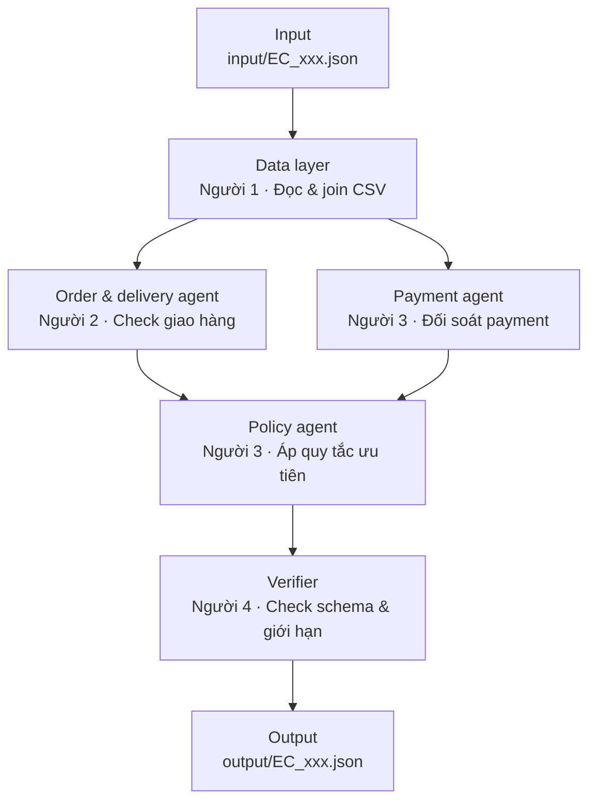

# Architecture — Multi-Agent E-commerce Dispute Resolution

## 1. Sơ đồ pipeline

> Dán khối trên vào GitHub — GitHub render mermaid trực tiếp trong file `.md`, không cần ảnh.

## 2. Vai trò từng agent

| Agent | Phụ trách | Input | Output | Quyền truy cập dữ liệu |
|---|---|---|---|---|
| **Data layer** | Người 1 | `claimed_order_id` | `CaseData` (order, items, payments) | Đọc 9 CSV trong `data/` |
| **Order & delivery agent** | Người 2 | `CaseData` | `DeliveryFindings` (seller vi phạm hạn, giao trễ hay không) | Chỉ đọc `order`, `items` từ `CaseData` |
| **Payment agent** | Người 3 | `CaseData` | `PaymentFindings` (đối soát tổng tiền, split payment) | Chỉ đọc `order`, `payments`, `items` từ `CaseData` |
| **Policy agent** | Người 3 | `DeliveryFindings` + `PaymentFindings` | `PolicyDecision` (primary issue, refund, action) | Không đọc CSV trực tiếp — chỉ nhận evidence đã tổng hợp từ 2 agent trên |
| **Verifier** | Người 4 | `PolicyDecision` | JSON đã validate, sẵn sàng ghi file | Không đọc CSV — chỉ kiểm tra format/giới hạn của `PolicyDecision` |
| **Coordinator** | Người 4 | `input/EC_xxx.json` | Điều phối toàn bộ luồng trên | Gọi tuần tự các agent, không tự suy luận nghiệp vụ |

## 3. Luồng handoff

1. **Coordinator** đọc 1 file case từ `input/`, lấy `claimed_order_id`.
2. **Data layer** tra CSV, trả về `CaseData` — dữ liệu thô, chưa có kết luận gì.
3. **Order & delivery agent** và **Payment agent** chạy song song trên cùng `CaseData`, mỗi agent chỉ phân tích domain của mình và tự sinh evidence ID theo đúng định dạng (`order:`, `item:`, `payment:`, `seller:`).
4. **Policy agent** nhận cả 2 bộ evidence, áp bảng quy tắc theo đúng thứ tự ưu tiên (canceled/unavailable → late delivery → split payment → reject), tính refund, chọn action.
5. **Verifier** kiểm tra: evidence ID đúng regex và tồn tại thật trong CSV, không vượt giới hạn số lượng (≤5 entity/set, ≤10 evidence, ≤3 causes, ≤3 parties, ≤5 actions), `confidence` ∈ [0,1].
6. **Coordinator** ghi kết quả đã verify vào `output/EC_xxx.json`, đồng thời log vào `trace.jsonl`.

Điểm cốt lõi: mỗi agent chỉ thấy đúng phần dữ liệu cần cho domain của mình (Policy agent không tự đọc CSV, Verifier không tự đọc CSV) — buộc hệ thống phải **handoff bằng chứng thật** giữa các agent thay vì gộp hết vào 1 prompt.

## 4. Model sử dụng

Mỗi agent dùng model ≤10B parameters (khai báo chi tiết trong `metadata.json`), gọi qua Groq API.

## 5. Contract dùng chung

Toàn bộ shape dữ liệu giữa các agent (`CaseData`, `DeliveryFindings`, `PaymentFindings`, `PolicyDecision`) được định nghĩa trong `contracts.py` ở root repo, đảm bảo 4 người code song song không bị lệch format.
